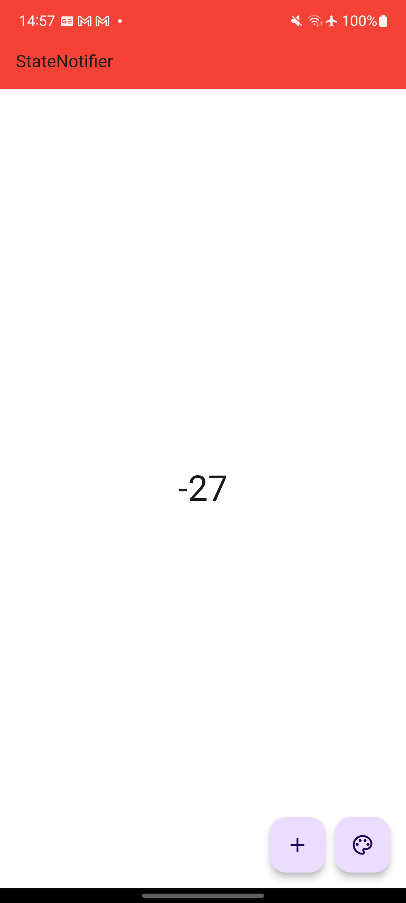

# state_notifier_exec

A new Flutter project.

This app covers 3 states. AppBar's background color state, and counter state, but the counter state is dependent on the background color. That is, if the background color is blue, it increases by 1,  if it is black, it increases by 10, and if it is red, it decreases by 10.

There is also a level state, which is dependent on the counter.
If the counter is below 50, it is bronze level. At this time, the background of the scaffold is white, if the counter is between 50 and 100, it is silver level, the background of the scaffold is gray, and if it is over 100, the level is gold, and the background of the scaffold is yellow.

## Getting Started

This project is a starting point for a Flutter application.

A few resources to get you started if this is your first Flutter project:

- [Lab: Write your first Flutter app](https://docs.flutter.dev/get-started/codelab)
- [Cookbook: Useful Flutter samples](https://docs.flutter.dev/cookbook)

For help getting started with Flutter development, view the
[online documentation](https://docs.flutter.dev/), which offers tutorials,
samples, guidance on mobile development, and a full API reference.
